# CubeSync Architecture — UML Diagrams

Mermaid-based UML diagrams describing the system structure, data flow, and behavior of the CubeSync application.

---

## 1. Component Diagram

High-level view of how pages, shared modules, and external services connect.

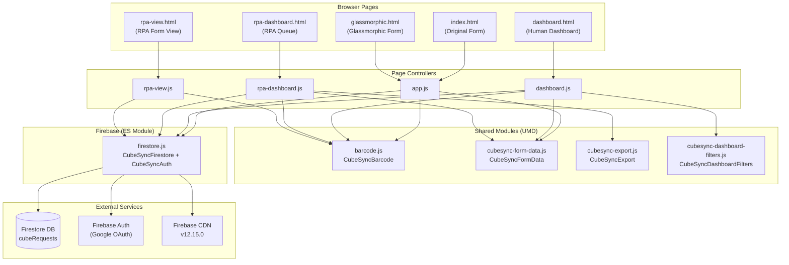

---

## 2. Class Diagram — Shared Module APIs

Each box represents a global object exposed on `window.*`. Methods and constants are listed with their signatures.

```mermaid
classDiagram
    class CubeSyncBarcode {
        +Array~String~ CODE_128_PATTERNS
        +encodeCode128B(value: String) Object
        +renderBarcodeSvg(value: String, options?: Object) String
        +sanitizeBarcodeText(value: String) String
    }

    class CubeSyncFormData {
        +String COLLECTION_NAME
        +Array~String~ FORM_FIELDS
        +Array~String~ RESULT_FIELDS
        +Array~String~ REQUIRED_FORM_FIELDS
        +buildCubeRequestFromForm(form: HTMLForm) Object
        +validateCubeRequestForm(form: HTMLForm, config?: Object) Object
        +applyFormFieldConfig(form: HTMLForm, config: Object, options?: Object) Object
        +syncNativeFormConstraints(form: HTMLForm, options: Object) void
        +normalizeCubeRequestForDashboard(data: Object, id: String) Object
        +dashboardEditToCubeRequest(formData: FormData) Object
        +buildCubeRequestUpdatePatch(existing: Object, payload: Object) Object
        +collectCustomFields(form: HTMLForm) Array~String~
        +deriveFreeTextDropdownFields(data: Object, optionsByField: Object) Array~String~
        +mergeFreeTextDropdownFields(...lists) Array~String~
        +applyFreeTextFlags(form: HTMLForm, customFieldNames: Array) void
    }

    class CubeSyncDashboardFilters {
        +parseDateKey(value: String) Number
        +collectFilterOptions(forms: Array) Object
        +applyDashboardFilters(forms: Array, criteria: Object) Array
    }

    class CubeSyncExport {
        +Number CSV_RESULT_HEADER_ROW
        +Number CSV_TEST_DATA_START_ROW
        +Array~Object~ REQUEST_FIELDS
        +Array~Object~ RESULT_FIELDS
        +buildFormCsv(form: Object) String
        +buildExportFiles(forms: Array) Array~Object~
        +createZipBlob(files: Array, modifiedAt?: Date) Blob
        +downloadFilesAsZip(files: Array, filename: String) Blob
    }

    class CubeSyncFirestore {
        +String COLLECTION_NAME
        +Object firebaseConfig
        +listCubeRequests() Promise~Array~
        +getCubeRequest(id: String) Promise~Object~
        +saveCubeRequest(payload: Object, id?: String) Promise~String~
        +savePublicCubeRequest(payload: Object, id: String, token: String) Promise~String~
        +updateCubeRequest(id: String, updates: Object) Promise~void~
        +deleteCubeRequest(id: String) Promise~String~
        +getFormFieldConfig() Promise~Object~
        +saveFormFieldConfig(config: Object) Promise~String~
    }

    class CubeSyncAuth {
        +Array~String~ CUBESYNC_ALLOWED_EMAILS
        +onAuthChange(callback: Function) Function
        +currentUser() User
        +isAllowedEmail(email: String) Boolean
        +isAllowedUser(user: User) Boolean
        +signInWithGoogle() Promise~User~
        +signOutUser() Promise~void~
    }

    CubeSyncFirestore ..> CubeSyncAuth : "same file (firestore.js)"

    class AppController {
        -Number currentStep
        -String currentDocId
        -renderBarcode(input: Element) void
        -resultRowHtml(rowCount: Number) String
        -setSaveStatus(el: Element, msg: String, err: Boolean) void
        -populateForm(form, data, tbody, addRow, renumber) void
        -updateSteps() void
        -renumberRows() void
        -addResultRow() void
    }

    class DashboardController {
        -Object state
        -renderForms() void
        -viewForm(id: String) void
        -loadForms() void
        -openEditor(id: String) void
        -saveEditedForm(event: Event) void
        -deleteForm(id: String) void
        -printForm(id: String) void
        -filteredForms() Array
        -bindAuthGate() void
    }

    class RPADashboardController {
        -Object state
        -renderQueue() void
        -loadQueue() void
        -updateERPStatus(id: String, status: String) void
        -toggleDisable(id: String) void
        -changeDate(days: Number) void
        -exportAllForms() void
        -getFilteredQueue() Array
        -bindAuthGate() void
    }

    class RPAViewController {
        -Object currentRecord
        -String documentId
        -renderRecord(record: Object) void
        -loadRecord() void
        -toggleDisable() void
        -renderBarcode(value: String) String
    }

    AppController --> CubeSyncBarcode : uses
    AppController --> CubeSyncFormData : uses
    AppController --> CubeSyncFirestore : uses

    DashboardController --> CubeSyncBarcode : uses
    DashboardController --> CubeSyncFormData : uses
    DashboardController --> CubeSyncDashboardFilters : uses
    DashboardController --> CubeSyncFirestore : uses
    DashboardController --> CubeSyncAuth : uses

    RPADashboardController --> CubeSyncBarcode : uses
    RPADashboardController --> CubeSyncFormData : uses
    RPADashboardController --> CubeSyncExport : uses
    RPADashboardController --> CubeSyncFirestore : uses
    RPADashboardController --> CubeSyncAuth : uses

    RPAViewController --> CubeSyncBarcode : uses
    RPAViewController --> CubeSyncFirestore : uses
```

---

## 3. Sequence Diagram — Form Submission

How a user fills out and saves a concrete cube request form.

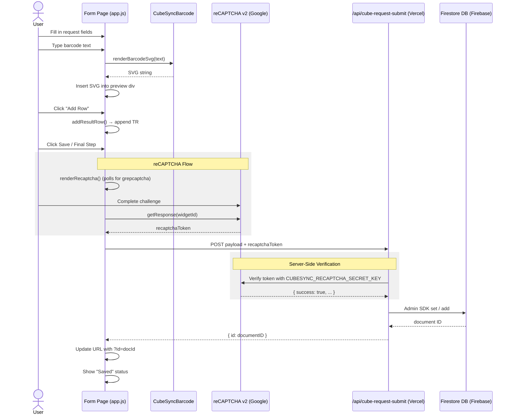

---

## 4. Security Architecture

CubeSync employs a hybrid security model to balance ease-of-use for customers with strict access control for internal staff.

### Public Submissions
Customers submitting cube requests do not need to sign in. Security is maintained through:
1.  **reCAPTCHA v2:** Prevents automated spam submissions.
2.  **API Proxy:** All public writes go through `/api/cube-request-submit`. This serverless function acts as a gatekeeper, verifying reCAPTCHA before using elevated Admin SDK privileges to write to Firestore.
3.  **Schema Validation:** The API function strictly validates the incoming JSON payload against the `FORM_FIELDS`, `ALLOWED_TEMPLATES`, and `ALLOWED_STATUSES` sets to prevent malicious data injection.

### Internal Operations
Dashboard and RPA operations require Google Authentication:
1.  **Firestore Rules:** CubeSync staff access uses `isCubeSyncStaff()` — verified email plus allowlist match in the `CUBESYNC-ONLY RULES` block (`cubeRequests`, `settings/formFieldConfig`).
2.  **Application Allowlist:** `firestore.js` maintains `CUBESYNC_ALLOWED_EMAILS`. The UI stays locked unless the signed-in email is on the list.
3.  **Organization overlap:** Some CubeSync staff are intentionally also WorkGrid hard-coded master/admin users because both apps are administered by the same organization. Add future CubeSync-only users only to the CubeSync allowlists unless they also need WorkGrid admin authority.
4.  **Update validation:** `isValidCubeRequestUpdate()` restricts which keys may change and validates field types. Rejections appear as `permission-denied` in the client SDK.
5.  **Patch writes:** The human dashboard sends only changed fields via `buildCubeRequestUpdatePatch()` to minimize validation surface area.

---

## 5. Sequence Diagram — Dashboard CRUD Flow

How the human dashboard loads, displays, edits, and deletes forms.

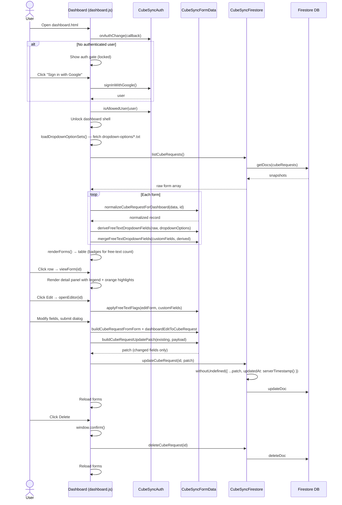

---

## 5. Sequence Diagram — RPA Export Flow

How the RPA dashboard exports all forms as a CSV ZIP archive.

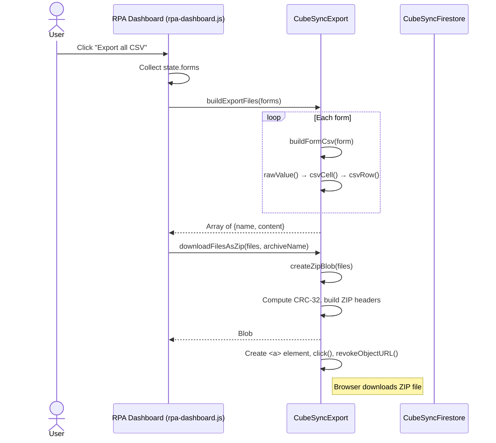

---

## 6. State Machine — Form Multi-Step Wizard

The stepped form navigation in `app.js`.

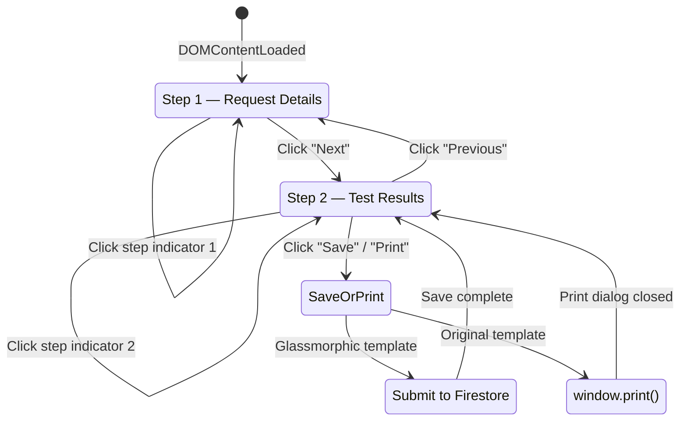

---

## 7. State Machine — Auth Gate

Shared auth flow used by `dashboard.js` and `rpa-dashboard.js`.

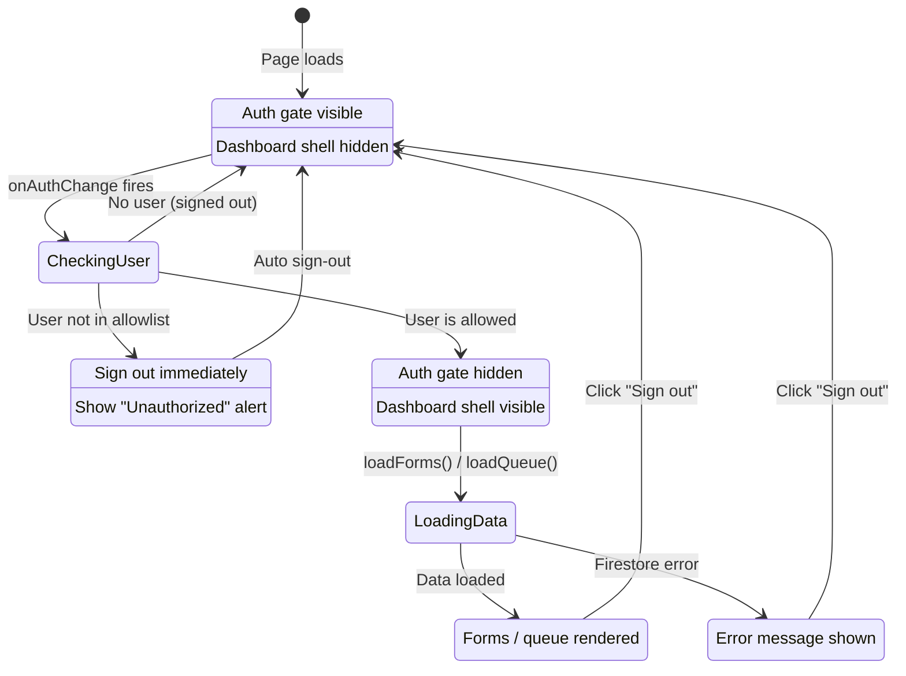

---

## 8. State Machine — RPA Status Lifecycle

How a form's RPA and ERP statuses evolve.

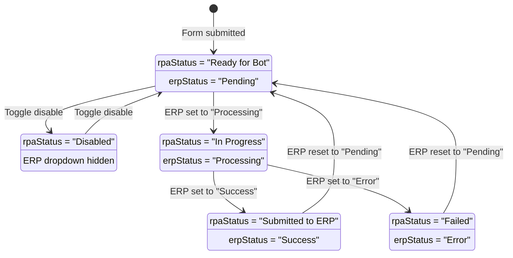

---

## 9. Entity-Relationship Diagram — Data Model

The Firestore document structure for `cubeRequests`.

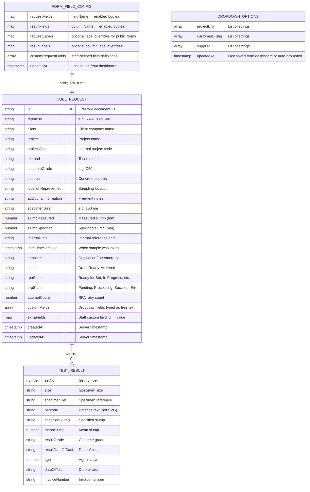

Settings document paths: `settings/formFieldConfig` and `settings/dropdownOptions` (single org-wide configs, not per request).

---

## 10. File Dependency Graph

Which source files depend on which.

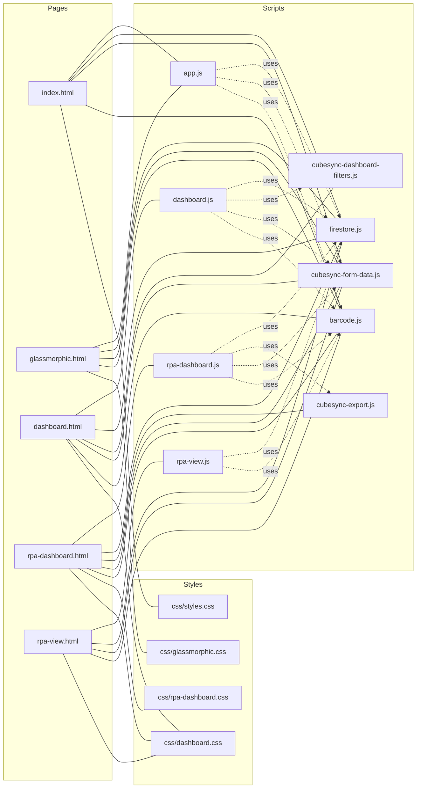

---

## 11. Test Architecture

The project uses Node’s built-in test runner with `jsdom` for DOM simulation. **145 tests** across unit, functional, and contract tiers.

```mermaid
graph TB
    subgraph UnitTests["Unit + regression tests"]
        T1[barcode.test.js]
        T2[export.test.js]
        T3[form-data.test.js]
        T4[form-field-config.test.js]
        T4b[free-text-dropdown.test.js]
    end

    subgraph FunctionalTests["Functional Tests (JSDOM + mocks)"]
        T5[app-functional.test.js]
        T6[dashboard-functional.test.js]
        T7[rpa-functional.test.js]
        T8[firestore-runtime.test.js]
    end

    subgraph ContractTests["Contract Tests (static regex)"]
        T9[form.test.js]
        T10[firestore.test.js]
        T11[deployment-config.test.js]
    end

    T1 -->|covers| B[barcode.js]
    T2 -->|covers| E[cubesync-export.js]
    T3 -->|covers| F[cubesync-form-data.js]
    T4 -->|covers| F
    T4b -->|regression: free-text review| F
    T4b -->|regression: dashboard wiring| C2

    T5 -->|exercises| C1[app.js]
    T6 -->|exercises| C2[dashboard.js]
    T7 -->|exercises| C3[rpa-dashboard.js]
    T8 -->|exercises| G[firestore.js]

    T10 -.->|validates rules contract| Rules[firestore.rules]
```
