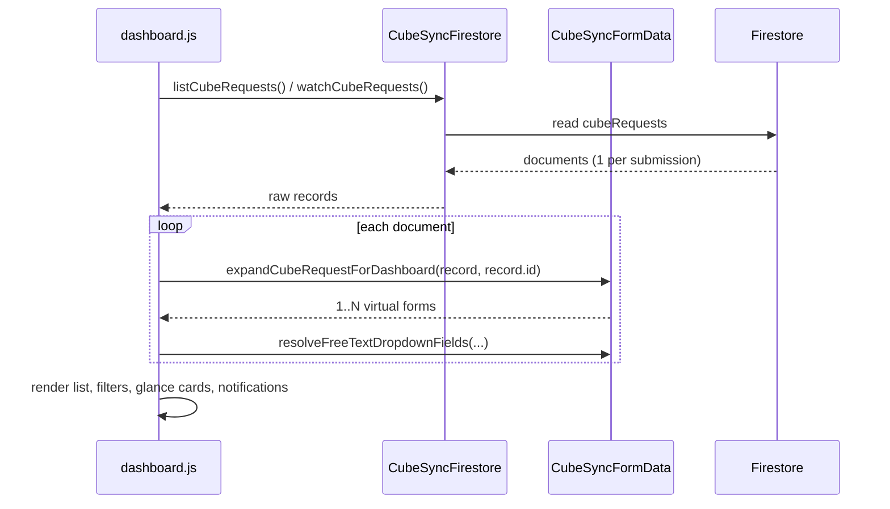

# Human Dashboard: One Form Per Test Set

Staff on the human dashboard (`dashboard.html`) work with **one form per unique cube test set**, even when the customer submitted several sets on a single CONCRETE CUBE TEST REQUEST FORM.

This is a **read-time view**. Firestore still stores one `cubeRequests/{id}` document with the full `results[]` array. Public submit, the serverless API, RPA, and Firestore rules are unchanged.

## Staff-facing behaviour

### Example

Client A submits one request that contains three test sets (different ages / dates of test), each with its own specimen rows:

| Set | Age (days) | Specimens |
|-----|------------|-----------|
| 1 | 7 | 2 cubes |
| 2 | 14 | 2 cubes |
| 3 | 28 | 3 cubes |

On the human dashboard the staff member sees **three list rows**, not one:

- Same client, project, project ERP, date of cast, cube job number, grades, supplier, location, contacts, and other request fields.
- Row labels like `REPORT-9 · Set 1`, `REPORT-9 · Set 2`, `REPORT-9 · Set 3`.
- Each row’s detail view, editor, barcodes, and printout contain **only that set’s specimen rows**.

A request with zero or one unique set still appears as a **single** dashboard form, using the real Firestore document id.

### What staff can do per row

| Action | Effect |
|--------|--------|
| View | Request details plus barcodes/results for that set only. |
| Edit | Same request fields; results table contains only that set. Saving writes those rows back into the source document without dropping sibling sets. |
| Print | Opens `index.html` or `glassmorphic.html` with `id={sourceId}&setNo=N&print=true`, so the printed sheet shows that set only. |
| Delete | Removes that set’s rows from the source document. The document is deleted only if no result rows remain. |

Editing a **request-level** field (client name, date of cast, cube job number, status, and so on) still updates the shared source document, so sibling set rows show the same details after reload.

## Why it is implemented this way

Splitting at dashboard read time keeps one physical submission as one Firestore job:

- RPA still sees **1 document = 1 job**.
- The public API still creates **one** `cubeRequests` document per submit.
- Cube job numbers, status, RPA/ERP fields, and edit history stay on a single record.
- No new collections, document ids, or fields are required.

Splitting on submit (one Firestore doc per set) would have required API, rules, RPA, notifications, and collision logic changes. That is intentionally out of scope.

## Firestore and security rules

**No Firestore rules change is required.**

| Concern | After this feature |
|---------|--------------------|
| Collection | Still `cubeRequests` |
| Document id | Still the auto-id from `/api/cube-request-submit` |
| `results` | Still a list of specimen objects (`RESULT_FIELDS`), max 50 rows |
| Virtual dashboard id | `abc#set-2` exists only in the browser. It is never a Firestore document id |
| Staff writes | `updateCubeRequest(sourceId, patch)` / `deleteCubeRequest(sourceId)` |
| Public writes | Unchanged create-only API |

Rules already allow staff to replace `results` with another list of at most 50 rows (`isValidCubeRequestUpdate()`). Saving one set sends the **merged** full array (edited set + untouched sibling sets), which is the same shape as a normal dashboard edit.

You would need a rules change only if you later:

- stored one document per set,
- wrote virtual ids such as `{id}#set-{n}` into Firestore,
- added new collections or required fields.

Do not do that without also updating RPA and the public submit API.

## Set identity

A **set** is the group of result rows that share the same `setNo`.

| Stored `setNo` | Dashboard group key |
|----------------|---------------------|
| `1`, `"1"`, `"01"` | `"1"` |
| `2` | `"2"` |
| missing, `null`, `""` | `"1"` (empty counts as set 1) |

Helpers live in `cubesync-form-data.js`:

- `normalizeSetNo(value)` — integer-like values become canonical strings (`2` → `"2"`).
- `resultRowSetNo(row)` — `normalizeSetNo(row.setNo) || "1"`.
- `groupResultRowsBySet(results)` — buckets rows, then sorts groups by earliest `dateOfTest`, then smallest age, then numeric set number.

That sort matches age-based set numbering on the public forms (`assignSetNumbersByAge` in `cubesync-table-manager.js`): earlier test dates appear as earlier sets in the dashboard list.

`hasRowValue()` still ignores `setNo` alone when collecting rows to save. A row that only has a set number and no specimen data is not persisted.

## Virtual dashboard forms

`expandCubeRequestForDashboard(data, id)` is the single entry point.

```text
unique setNos in results[]
        │
        ├── 0 or 1 unique set ──► one form
        │                         id            = Firestore id
        │                         sourceRequestId = Firestore id
        │                         setNo         = that set, if any
        │
        └── 2+ unique sets ─────► one form per set
                                  id            = "{sourceId}#set-{setNo}"
                                  sourceRequestId = Firestore id
                                  setNo         = that set
                                  reportNo      = "{reportNo} · Set {n}"
                                  cubeJob       = unsuffixed cube job number
                                  raw.results   = rows for that set only
```

`parseDashboardFormId(id)` reverses a virtual id:

| Input | `sourceRequestId` | `setNo` |
|-------|-------------------|---------|
| `abc` | `abc` | `null` |
| `abc#set-2` | `abc` | `"2"` |

`#` is used only in the in-memory dashboard id. Print URLs never put `#set-` into `?id=`, because `#` would become a URL fragment. Print uses `?id={sourceId}&setNo=N` instead.

## Runtime flows

### Load list (`dashboard.js` → `applyFormRecords`)



RPA (`rpa-dashboard.js`) does **not** call `expandCubeRequestForDashboard`. The bot queue remains one row per Firestore document.

### Save one set

1. The editor hidden `id` is the virtual id (`abc#set-1`) so the dashboard knows which set is open.
2. `parseDashboardFormId` yields `{ sourceRequestId, setNo }`.
3. If `setNo` is present (split form):
   - Load the full source document via `getCubeRequest(sourceId)` when the store provides it.
   - Otherwise reconstruct the full `results[]` from sibling virtual forms already on screen (`reconstructCubeRequestFromDashboardForms`). Tests often omit `getCubeRequest`; production `firestore.js` has it.
   - `mergeResultSetIntoDocument(existing.results, setNo, editedRows)` replaces only that set’s rows and stamps `setNo` on the edited rows so they cannot migrate to another set from this form.
4. `buildCubeRequestUpdatePatch(fullExisting, payload)` still sends only changed fields.
5. `updateCubeRequest(sourceId, patch)` writes the real document.
6. Edit history is appended on `sourceId`, not the virtual id.

If `setNo` is null (unsplit form), save behaviour is the previous path: update that document id directly.

### Delete one set

Confirm copy distinguishes a set delete from a whole-request delete.

- Split form: drop rows whose `resultRowSetNo` matches the set. If rows remain, `updateCubeRequest(sourceId, { results })`. If none remain, `deleteCubeRequest(sourceId)`.
- Unsplit form: `deleteCubeRequest(id)` as before.

### Print one set

```text
{index|glassmorphic}.html?id={sourceId}&print=true&setNo={n}
```

`app.js` loads the **source** document with `getCubeRequest(id)`, then `filterResultsBySetNo(results, setNo)` before `populateForm()`. Extra empty seed rows on the glassmorphic table are removed so the printout does not show blank specimen lines.

Unsplit print URLs stay `?id={id}&print=true` with no `setNo`.

### Edit history

The history tab lists `cubeRequests/{sourceId}/editHistory`. Switching between Set 1 and Set 2 of the same request shows the same changelog, because both virtual forms share one document.

### Cube job collisions

Sibling sets share the same cube job number. They must **not** count as a collision with each other.

- Collision index keeps one representative per `sourceRequestId`.
- Peer lists exclude forms with the same `sourceRequestId`.
- At-a-glance / metrics use `uniqueDashboardFormsBySource()` so one multi-set submission counts as one request.

A true duplicate (two different submissions with cube job `CJ-100`) still flags every set-row of both requests.

### Notifications

`submissionKey(form)` prefers `sourceRequestId`, then `id`.

- One physical submit that expands to three list rows raises **one** “new cube request” alert.
- Status transitions (Ready, RPA failed, and so on) fire **once** per source document.

## Surfaces that do not split

| Surface | Behaviour |
|---------|-----------|
| `index.html` / `glassmorphic.html` submit | One payload, one API create, all sets in `results[]`. |
| `/api/cube-request-submit` | Unchanged. |
| `rpa-dashboard.html` / `rpa-view.html` | One queue row / one view per Firestore document, all result rows. |
| Metrics page (`metrics.html`) | Reads documents directly; no virtual ids. |
| CSV/ZIP export from RPA | Full `results[]` on the source record. |

Bots must keep binding to canonical Firestore ids and `results[]`, never to `id#set-n`. See [RPA_SELECTOR_REFERENCE.md](RPA_SELECTOR_REFERENCE.md).

## Helper API (`cubesync-form-data.js`)

| Function | Role |
|----------|------|
| `expandCubeRequestForDashboard(data, id)` | 1..N dashboard forms from one document. |
| `parseDashboardFormId(id)` | `{ sourceRequestId, setNo }`. |
| `dashboardSourceRequestId(form)` | `sourceRequestId` or parsed id. |
| `uniqueDashboardFormsBySource(forms)` | Dedupe virtual rows for metrics/alerts. |
| `groupResultRowsBySet(results)` | Bucket + chronological sort. |
| `normalizeSetNo` / `resultRowSetNo` | Canonical set keys. |
| `filterResultsBySetNo(results, setNo)` | Print / load subset. |
| `mergeResultSetIntoDocument(existing, setNo, editedRows)` | Replace one set in the full array. |
| `reconstructCubeRequestFromDashboardForms(forms, sourceId)` | Rebuild full raw from sibling virtual forms. |

## Edge cases

| Case | Behaviour |
|------|-----------|
| No result rows | One dashboard form, original id. |
| All rows missing `setNo` | Treated as set 1; one form. |
| Mix of empty `setNo` and `1` | Same group. |
| Add a specimen on a split editor | Saved rows are stamped with that form’s set number. |
| Clear every row of a set and save | That set is removed from the document; the virtual row disappears after reload. |
| Change date of cast on Set 2 | Shared request field; all set-rows show the new date after reload. |
| Service worker | `CACHE_NAME` is `cubesync-v20` so staff browsers pick up `dashboard.js` / `app.js` / form-data changes. |

## Tests

| File | What it locks |
|------|----------------|
| `form-data.test.js` | Expand, parse, merge, reconstruct, filter, empty-set-as-1, unsuffixed cube job, chronological set order. |
| `dashboard-functional.test.js` | 1 document / 3 sets → 3 list rows; editor shows only that set; save of set 1 keeps set 2; print URL uses source id + `setNo`; delete set updates remaining rows. |
| `app-unit.test.js` | `?setNo=2` loads only that set’s specimen inputs. |
| `cubesync-notifications.test.js` | `sourceRequestId` submission key; new-submission and status alerts collapse sibling sets. |
| `dashboard.test.js` | Dashboard source calls `expandCubeRequestForDashboard`. |
| `sw.test.js` | `cubesync-v19` cache name is gone. |

Run `npm run test:app`. Firestore emulator / rules tests are not required for this feature.

## Related documents

- [dashboard-sort-and-filter.md](dashboard-sort-and-filter.md) — list filters apply **after** expansion (each set-row is a filterable form).
- [print-layout.md](print-layout.md) — print CSS; set filtering is in `app.js`, not the stylesheet.
- [RPA_SELECTOR_REFERENCE.md](RPA_SELECTOR_REFERENCE.md) — bots stay on real document ids.
- [firestore-rules-expression-limit-postmortem.md](firestore-rules-expression-limit-postmortem.md) — still relevant for large multi-field patches; split-by-set does not add a new write shape beyond replacing `results`.
