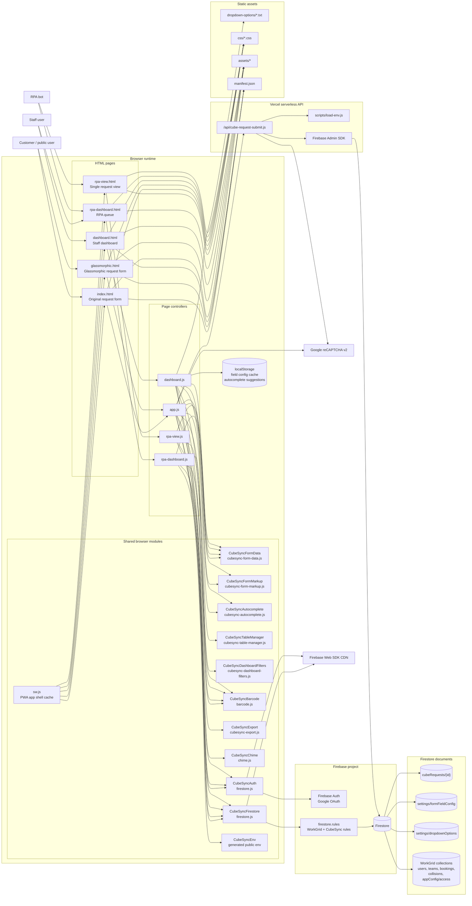
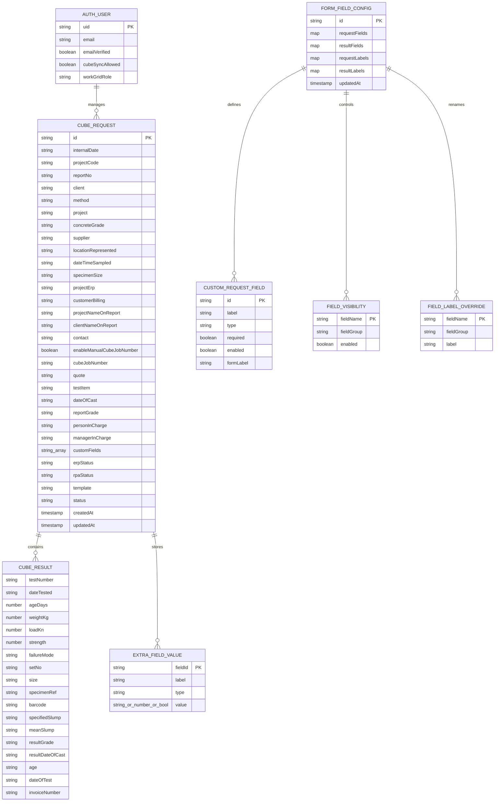
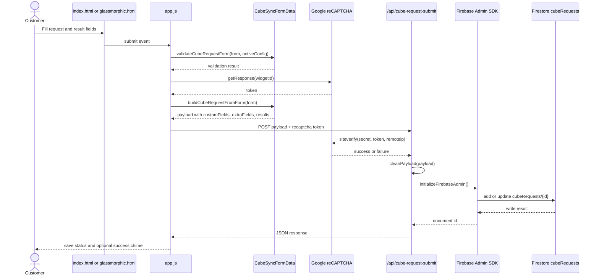
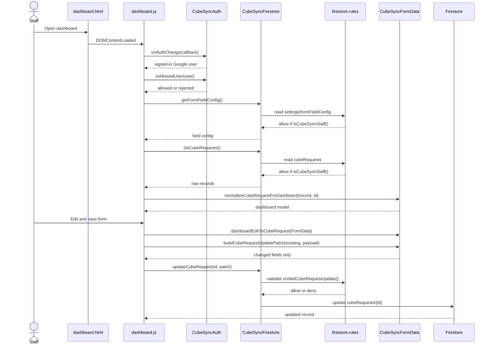
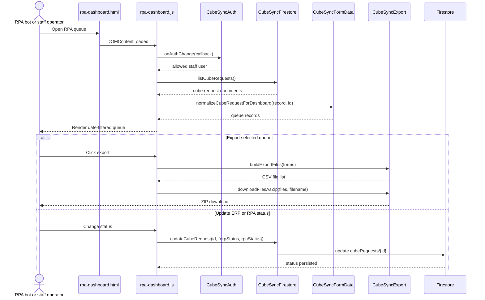
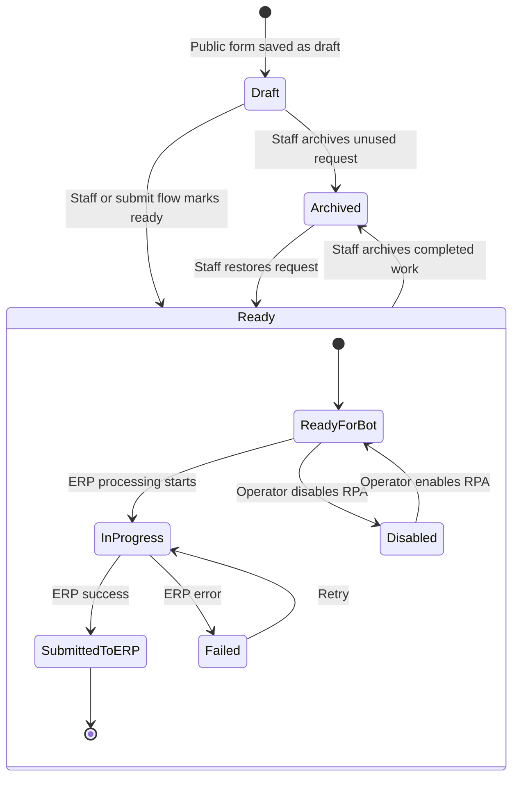
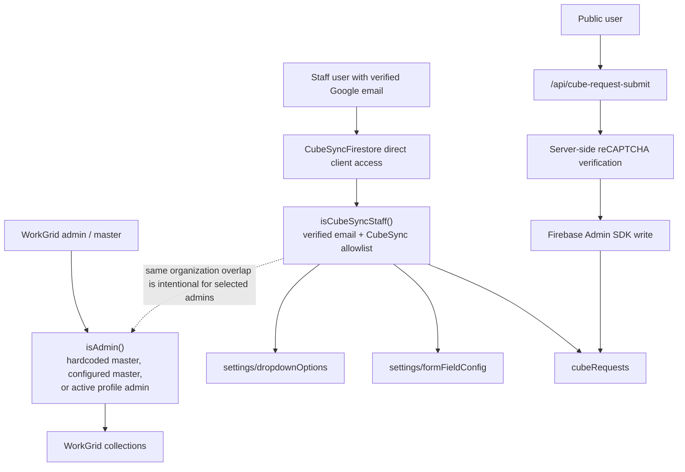

# CubeSync Project UML

Comprehensive Mermaid UML diagrams for the current CubeSync application. These diagrams cover browser surfaces, page controllers, shared UMD modules, Firebase integration, serverless submission flow, Firestore data, and operational state transitions.

## 1. System Component Diagram

## 2. Class And Module Diagram

```mermaid
classDiagram
    direction LR

    class AppController {
        +DOMContentLoaded()
        -renderBarcode(input)
        -renderAll(inputs)
        -validateRequestDetails(form, helper, status, config, navigate)
        -loadAndApplyFormFieldConfig(form)
        -populateForm(form, data, tableBody, addRow, renumberRows)
        -submitForm(form, submitter)
        -renderRecaptcha(container, status, attempt)
        -recaptchaToken(container)
        -resetRecaptcha(container)
        -updateSteps()
        -addResultRowWrapper()
        -renumberRowsWrapper()
    }

    class DashboardController {
        +DOMContentLoaded()
        -loadDropdownOptionSets()
        -loadForms()
        -renderForms()
        -viewForm(id)
        -openEditor(id)
        -saveEditedForm(event)
        -deleteForm(id)
        -printForm(id)
        -loadFieldConfig()
        -saveFieldConfig(event)
        -bindAuthGate()
    }

    class RpaDashboardController {
        +DOMContentLoaded()
        -loadQueue()
        -renderQueue()
        -updateERPStatus(id, status)
        -toggleDisable(id)
        -changeDate(days)
        -exportAllForms()
        -bindAuthGate()
    }

    class RpaViewController {
        +DOMContentLoaded()
        -loadRecord()
        -renderRecord(record)
        -toggleDisable()
        -renderBarcode(value)
    }

    class CubeSyncFormData {
        +COLLECTION_NAME
        +SETTINGS_COLLECTION
        +FORM_FIELD_CONFIG_DOC_ID
        +FORM_FIELD_CONFIG_STORAGE_KEY
        +FORM_FIELDS
        +REQUIRED_FORM_FIELDS
        +RESULT_FIELDS
        +DROPDOWN_OPTION_FIELDS
        +REQUEST_FIELD_LABELS
        +RESULT_FIELD_LABELS
        +CUSTOM_FIELD_TYPES
        +MAX_CUSTOM_REQUEST_FIELDS
        +defaultFormFieldConfig()
        +normalizeFormFieldConfig(raw)
        +normalizeCustomRequestFields(raw)
        +applyCustomRequestFields(container, config)
        +collectExtraFields(form)
        +validateExtraFields(extraFields, config)
        +readFormFieldConfigFromEditor(form)
        +applyFormFieldConfig(form, config, options)
        +syncNativeFormConstraints(form, options)
        +validateCubeRequestForm(form, config)
        +validateCubeRequestPayload(payload, config)
        +buildCubeRequestFromForm(form)
        +dashboardEditToCubeRequest(formData)
        +buildCubeRequestUpdatePatch(existing, payload)
        +normalizeCubeRequestForDashboard(data, id)
        +deriveFreeTextDropdownFields(data, optionsByField)
        +resolveFreeTextDropdownFields(data, optionsByField, metadataFields)
        +applyFreeTextFlags(form, customFieldNames)
    }

    class CubeSyncDashboardFilters {
        +parseDateKey(value)
        +collectFilterOptions(forms)
        +applyDashboardFilters(forms, criteria)
    }

    class CubeSyncFormMarkup {
        +RESULT_COLUMNS
        +resultTableHeadHtml()
        +resultRowHtml(rowCount)
        +seedResultRows(tableBody, count)
        +resultRowFieldNames(rowIndex)
    }

    class CubeSyncAutocomplete {
        +setupAutocomplete(inputName, fetchUrl, storageKey)
        +setFreeTextState(input, isFreeText)
    }

    class CubeSyncTableManager {
        +computeRowAge(row)
        +prefillRowFromRequest(row, form)
        +renumberRows(tableBody)
        +attachRowListeners(row, tableBody, renderBarcodeCb)
        +addResultRow(tableBody, form, renderBarcodeCb, onRowAdded)
    }

    class CubeSyncBarcode {
        +CODE_128_PATTERNS
        +sanitizeBarcodeText(value)
        +encodeCode128B(value)
        +renderBarcodeSvg(value, options)
    }

    class CubeSyncExport {
        +CSV_RESULT_HEADER_ROW
        +CSV_TEST_DATA_START_ROW
        +REQUEST_FIELDS
        +RESULT_FIELDS
        +buildFormCsv(form)
        +buildExportFiles(forms)
        +createZipBlob(files, modifiedAt)
        +downloadFilesAsZip(files, filename)
    }

    class CubeSyncFirestore {
        +listCubeRequests()
        +getCubeRequest(id)
        +saveCubeRequest(payload, id)
        +savePublicCubeRequest(payload, id, recaptchaToken)
        +updateCubeRequest(id, updates)
        +deleteCubeRequest(id)
        +getFormFieldConfig()
        +saveFormFieldConfig(config)
    }

    class CubeSyncAuth {
        +CUBESYNC_ALLOWED_EMAILS
        +onAuthChange(callback)
        +currentUser()
        +isAllowedEmail(email)
        +isAllowedUser(user)
        +signInWithGoogle()
        +signOutUser()
    }

    class CubeSyncChime {
        +playButtonChime()
        +playUpliftingChime()
        +showEncouragingPopup(message)
        +attachButtonChimes()
    }

    class CubeRequestSubmitApi {
        +handler(request, response)
        -setApiHeaders(request, response)
        -parseServiceAccount(raw)
        -initializeFirebaseAdmin()
        -verifyRecaptcha(token, remoteAddress)
        -cleanPayload(payload)
        -cleanExtraFields(value)
        -isValidDocumentId(id)
    }

    class FirestoreRules {
        +isCubeSyncStaff()
        +isCubeSyncAllowedEmail()
        +isValidCubeRequest(data)
        +isValidCubeRequestUpdate()
        +isValidFormFieldConfig(data)
        +isAdmin()
        +isActiveUser()
        +canWriteBookings()
    }

    AppController ..> CubeSyncFormData : validates and serializes
    AppController ..> CubeSyncFormMarkup : creates result rows
    AppController ..> CubeSyncAutocomplete : dropdowns
    AppController ..> CubeSyncTableManager : row behavior
    AppController ..> CubeSyncBarcode : barcode preview
    AppController ..> CubeSyncFirestore : load existing records
    AppController ..> CubeSyncChime : success feedback
    AppController ..> CubeRequestSubmitApi : public save

    DashboardController ..> CubeSyncAuth : gates staff access
    DashboardController ..> CubeSyncFirestore : CRUD and field settings
    DashboardController ..> CubeSyncFormData : normalize, edit, patch
    DashboardController ..> CubeSyncDashboardFilters : list filtering and sort
    DashboardController ..> CubeSyncFormMarkup : editor rows
    DashboardController ..> CubeSyncAutocomplete : editor dropdowns
    DashboardController ..> CubeSyncBarcode : detail and editor previews

    RpaDashboardController ..> CubeSyncAuth : gates RPA access
    RpaDashboardController ..> CubeSyncFirestore : queue status updates
    RpaDashboardController ..> CubeSyncFormData : queue normalization
    RpaDashboardController ..> CubeSyncExport : CSV and ZIP

    RpaViewController ..> CubeSyncAuth : gates single view
    RpaViewController ..> CubeSyncFirestore : loads request
    RpaViewController ..> CubeSyncFormData : displays fields
    RpaViewController ..> CubeSyncBarcode : barcode SVGs

    CubeSyncFirestore ..> CubeSyncAuth : same Firebase app
    CubeSyncFirestore ..> FirestoreRules : direct client writes
    CubeRequestSubmitApi ..> FirestoreRules : bypassed by Admin SDK
```

## 3. Firestore Domain Model

## 4. Public Submission Sequence

## 5. Staff Dashboard Edit Sequence

## 6. RPA Queue And Export Sequence

## 7. Request And Automation State Diagram

## 8. Security Boundary Diagram

