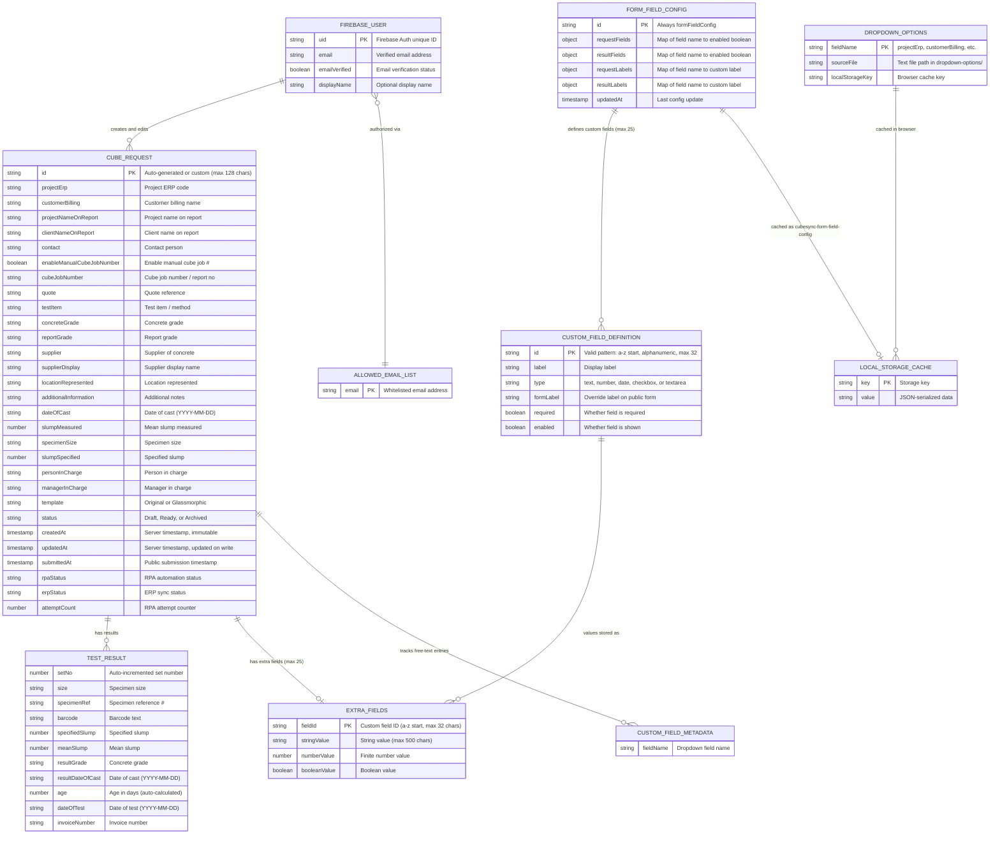

# CubeSync Entity-Relationship Diagram



## Entity Details

### CubeRequest (Firestore: `cubeRequests/{id}`)
The central entity. Represents a concrete cube test request form submission.
- **Templates:** `Original` | `Glassmorphic`
- **Statuses:** `Draft` | `Ready` | `Archived`
- **RPA Statuses:** `Ready for Bot` | `In Progress` | `Submitted to ERP` | `Failed` | `Disabled`
- **ERP Statuses:** `Pending` | `Processing` | `Success` | `Error`
- **Legacy aliases:** `reportNo`/`reportNumber` for `cubeJobNumber`, `client` for `customerBilling`, `project` for `projectNameOnReport`, `method` for `testItem`, `grade` for `concreteGrade`

### TestResult (embedded array in CubeRequest.results)
Each cube request can have 0..N test result rows. `age` is auto-calculated as `dateOfTest - resultDateOfCast` in days.

### ExtraFields (embedded object in CubeRequest.extraFields)
Up to 25 custom key-value pairs. Keys must match `^[a-z][a-zA-Z0-9_]{0,31}$` and not collide with reserved field IDs. Values are strings (max 500 chars), finite numbers, or booleans.

### FormFieldConfig (Firestore: `settings/formFieldConfig`)
Singleton document controlling which fields are visible/required and their labels. Staff can toggle fields on/off and rename labels from the dashboard.

### CustomFieldDefinition (embedded array in FormFieldConfig.customRequestFields)
Defines additional fields beyond the standard schema. Types: `text`, `number`, `date`, `checkbox`, `textarea`.

### FirebaseUser (Firebase Authentication)
Google-authenticated users. Only emails in the hardcoded allowlist can access the staff dashboard and RPA queue.

### DropdownOptions (file-based + localStorage)
Eight dropdown fields load options from text files and cache selections in localStorage:

| Field | Source File | localStorage Key |
|-------|------------|-----------------|
| projectErp | `dropdown-options/project erp.txt` | `savedProjectErps` |
| customerBilling | `dropdown-options/customer billing.txt` | `savedCustomerBillings` |
| supplier | `dropdown-options/supplier.txt` | `savedSuppliers` |
| concreteGrade | `dropdown-options/Grade.txt` | `savedGrades` |
| personInCharge | `dropdown-options/person-in-charge.txt` | `savedPersonsInCharge` |
| managerInCharge | `dropdown-options/manager-in-charge.txt` | `savedManagersInCharge` |
| testItem | `dropdown-options/testitem.txt` | `savedTestItems` |
| specimenSize | `dropdown-options/size.txt` | `savedSizes` |

## Data Flow

```
Public Form (app.js)
    |
    | POST /api/cube-request-submit
    | (reCAPTCHA verified)
    v
Firestore: cubeRequests/{id}
    |
    +---> Staff Dashboard (dashboard.js)
    |         - List, filter, edit forms
    |         - Manage field config
    |
    +---> RPA Dashboard (rpa-dashboard.js)
    |         - Queue by SGT date
    |         - Update ERP/RPA status
    |         - Export CSV/ZIP
    |
    +---> RPA View (rpa-view.js)
              - Read-only form view
              - ERP status controls
              - Enable/Disable RPA toggle
```
